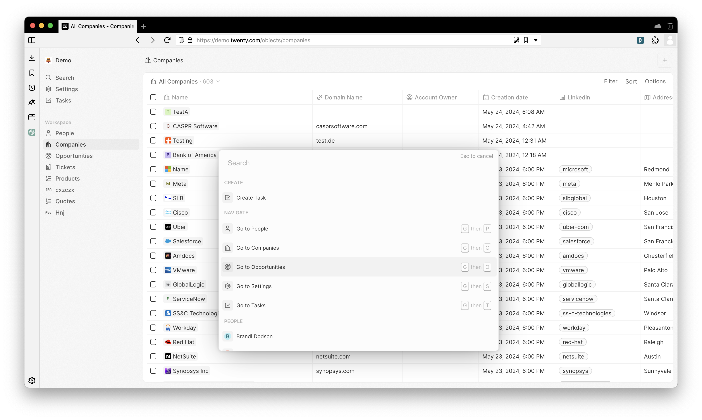
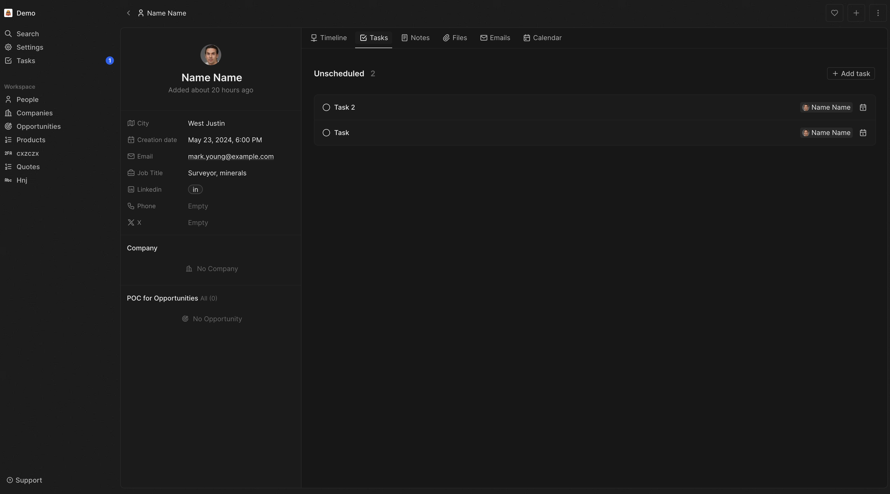
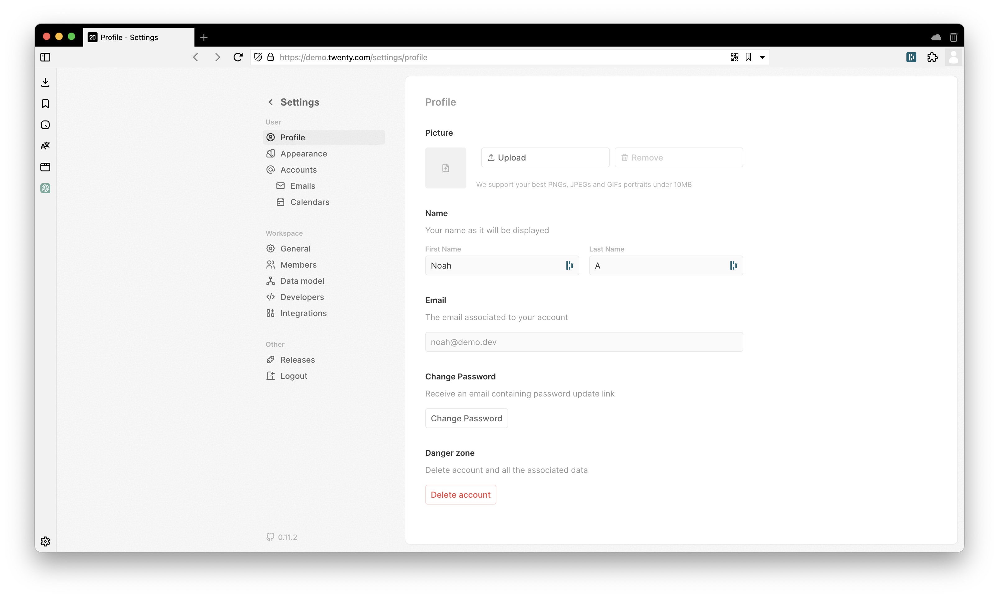

# "Create a CRM in NextJS" frontend challenge

Welcome. For this project, we will be rigorously testing your abilities to design complete, easy-to-use, and attractive frontend UIs using a modern tech stack. We will be assessing you on your code quality, design sense, and attention to detail. Please aim to spend about 15 hours on this task. This task is intentionally open-ended to test how you approach architectural decisions and turn broad ideas into specific features.

Your task is to build the frontend for a CRM (customer relationship management) tool. You will be recreating parts of [Twenty.com](https://twenty.com/) using NextJS, React, and Shadcn UI.

You can log in to a demo Twenty account (https://demo.twenty.com) using these credentials:

```
Email: noah@demo.dev
Password: Applecar2025
```

Your requirements are below. We encourage you to think deeply about these features and add any polish or advanced functionality that would make the product more useful. Impress us!

### 1. Side navigation

- Build a sidebar that includes tabs like Prospects, Companies, Settings, etc. Add any other tabs that you think might be relevant for a CRM. You don't need to build out all the pages (besides the ones we call out below).
- Ensure the side navigation is grouped by subsections.
- Add tabs for Search, Notifications, and Tasks like in Twenty.
- Show information about the logged-in user or their organization.

### 2. Command bar

- Add a command bar that appears when the user presses Command + K. This should look similar to the command bar on Twenty.
- The command bar should allow users to search and directly navigate to any page in the app.
- Users should be able to search prospects and companies and see a detailed view of the selected item.
- Users should be able to take actions like adding tasks through this command bar.

A screenshot of this component can be found at 

### 3. People page

Recreate Twenty's People Page, in particular its interactive table of prospects. You should store a list of example prospects in memory (i.e. define them as a big TypeScript object), such that you can add/edit/delete them in the UI. You don't have to persist the changes anywhere; it's OK if the CRM data resets when the user reloads the page.

In the table, users should be able to:

- Add, edit, and delete rows (one at a time or in bulk).
- Sort rows and filter on specific columns.
- Click into a cell to edit it.
- Add custom columns with a specific type (text, checkbox, date, number, etc).

When a prospect is clicked, display their information neatly on the left-hand side with tabs for Tasks, Notes, and Emails. (You can hardcode in this data, although users should be able to edit it in memory). A screenshot of this view can be found at .

### 4. Settings page

When the user opens the Settings menu, they should see a sidebar where they can click between different sections. Build the following pages:

- Profile: Basic configuration options, like profile picture, name, email, password, etc.
- Appearance: Create four themes that the user can switch between: Light, Dark, Purple Light, Purple Dark. The UI should change accordingly.
- Any other settings you think are important.

A screenshot of this view can be found at .

### 5. Tasks

Create a to-do list where the user can manage their tasks. Look at Twenty and use your judgment to figure out what features are required.

You should be able to connect tasks to prospects to that users can see all the tasks for a prospect when they open the prospect view (as discussed above).

### Tech stack

You must use Shadcn's UI components; you may add custom Tailwind styles if necessary. You must use Next.js and TypeScript. This repository has already been set up with all those libraries.

You can bring in other NPM utility and React libraries if you like. Some suggestions:

- `usehooks-ts`
- TanStack Query
- TanStack Table
- `clsx`
- `true-myth`
- `immutable`
- `zod`
- `ts-pattern`
- `lodash` or `lodash-es`
- `immer`
- `rambda`
- `dayjs`

### Evaluation criteria

- Code quality: Clean, readable, and maintainable code using proper React style
- Design sense: Attractive, intuitive, and user-friendly design
- Attention to detail: Thoroughness in implementing features as described
- Initiative: Adding features or polish beyond just what we described here

We understand that this is a lengthy task and you may not be able to create everything. We expect you to complete as many of the specified tasks as possible within about 15 hours.

## Logistics

### Installing, building, and running

Once you download this package, do:

```ts
npm install
```

To compile and build, do:

```ts
npx tsc
npm run build
```

To run a local server:

```ts
npm run dev
```

Then open up <http://localhost:3000>.

### Deployment

Please deploy your assessment to Vercel using the command line interface. You should be able to sign up for a free account and do all this for free. 

Be sure that your project's public URL can be viewed by anyone. You don't need to use a custom domain -- just deploy at `[something].vercel.app`.

### Submission

Please include a submission.md file in your repository that contains the Vercel deployment URL.
